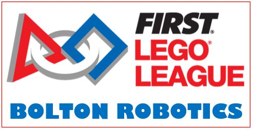
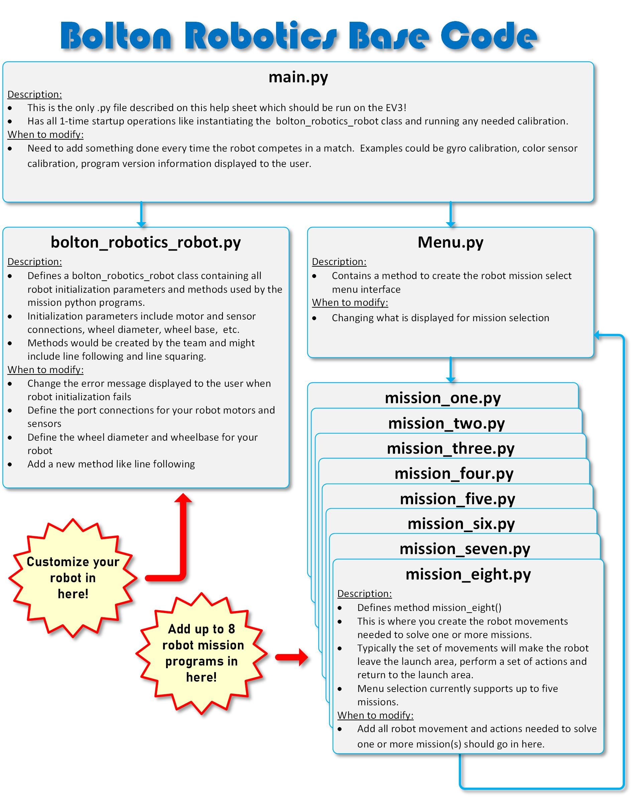

## Getting Started
Welcome to the Bolton Robotics FLL Micropython for EV3 Training Course!  A set of short lessons below are divided between using a virtual robot simulator and lessons run on the EV3.

After completing each lesson module, students are expected to share their solutions with mentors to get credit for the lesson before moving to the next module. 

When all the training modules are complete, students can move on to the **Bolton Robotics "Around Bolton" Game**.  In this game you will get to build with legos onto an EV3 basebot and create your own programs!  This is like the official FLL competition in the fall and has a series of fun challenges for you solve in a two minutes and thirty second run.

## Don't Panic!
Everyone *-including the mentors-* are excited to help each other learn something new!  If you get stuck, please ask for help.  If you figure out how to do something new and amazing, share it with the students & mentors :-)

## Training Modules
- __1__ [Create Your First Python Program](./lessons/lesson1/lesson1.md) : Using the simulator write a python script to move virtual blocks into scoring areas
- __2__ [First Python Program on the EV3](./lesson2/lesson2.md) : Use the EV3 robot write a python script to move blocks into scoring areas
- __3__ [Changing Speed Using the Drivebase Settings](./lessons/drivebase_settings/drivebase_settings.md) : Use the drivebase settings to change the speed of your robot
- __4__ [Code Debugging](./lessons/debugging/debugging.md) : How to debug your python program
- __5__ [Code Loops](./lessons/loops/loops.md) : Learn how to use a code loop to perform a repeated action
- __6__ [Driving Using Code Loops](./lessons/driving_with_loops/driving_with_loops.md) : Using loops to drive on a curve and line follow
- __7__ [Using the EV3 display](./lessons/display/display.md) : Learn how to display text on the EV3 display
- TBD - Using the EV3 buttons to select a python program

## Bolton Robotics "Around Bolton" Game
- [Bolton Robotics "Around Bolton" Robot Game](./spring_2022/robot_game.md) : After completing all lessons students may work on the robot game.

## Additional How-To's (students are not required to complete this training)
- [Helpful Python Commands](./howto/Python_Commands.pdf) : List of helpful commands including how to use attachment motors
- [Color Sensor Calibration](./calibration/calibration.md) : Color Sensor Calibration Routine for line following

## Base Code Repo For Fall Competition
Github Repo for Bolton robotics base Python code:
[https://github.com/fssfll/fll_basecode](https://github.com/fssfll/fll_basecode)

The Bolton Robotics base code provides a generic python project template which may then be customized by the team.  The template creates a robot_name class and uses a constructor to initialize settings and parameters.  It also provides a simple menu to select between five empty mission templates.  

## More Resources
* [Pybricks Documentation](https://pybricks.com/ev3-micropython/index.html)
