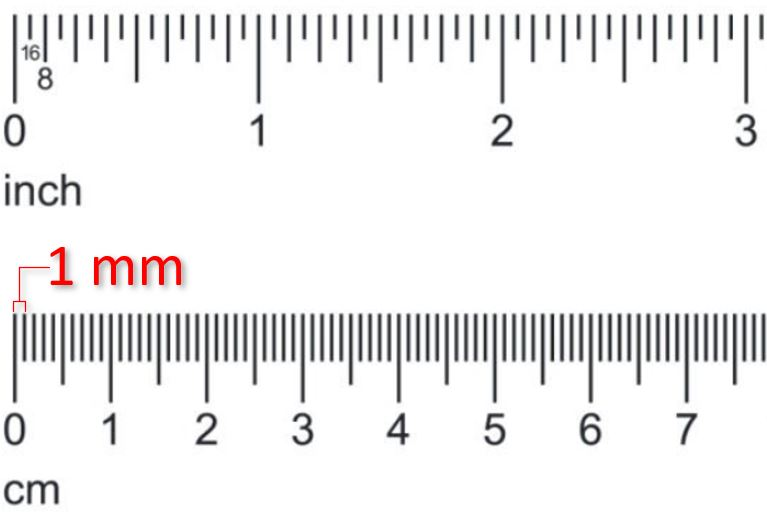

# Lesson #1: Create and Simulate Your First Python Program

### Lesson Plan:
1. Watch the lesson plan video below
2. Follow the instructions to complete the assignment.  Be sure to complete all the steps!
3. Show or share the completed assignment with a mentor

<p align="center">
<iframe width="560" height="315" src="https://www.youtube.com/embed/Yr5yAB4Nweo" title="YouTube video player" frameborder="0" allow="accelerometer; autoplay; clipboard-write; encrypted-media; gyroscope; picture-in-picture" allowfullscreen></iframe>
</p>

### 1. In a different browser window or browser tab start the simulator: 
[Launch FSS FLL Simulator: LESSON 1](https://fssfll.github.io/gears/public/index.html?worldJSON=https%3A%2F%2Ffssfll.github.io%2Ffssfll%2Flessons%2Flesson1%2Flesson1.json)
  * Once in the simulator, navigate between programming and running the bot using the menu tabs in the upper left.  Try navigating between the menu options.
  * **Blocks Tab:** Allows for using Scratch like programming blocks to build a Python program.  
  * **Python Tab:** This is the python program run by the simulator.  You can write your Python program right in the browser or you can load it using the "File->Load Python from your computer" menu.  Python programs can also be saved back to your computer using the "File->Save Python to your computer" option.
  * **Simulator Tab:** This is the robot simulation environmnent.  You can simulate your Python program on to scale a virtual robot.
  * **File Menu:** Use this to load or save python programs
  * **Python Menu:** Use this to select the version of python to use with your program.
  * **Robot Menu:** Use this to select your robot.  For this lesson, the default robot "FSS FLL Single Sensor Line Follower" is selected already.
  * **Worlds Menu:** Use this to select the game table.  For this lesson the game table is selected already.

### 2. Navigate to the "Simulator" tab.  
  * Click on the "Follow" camera icon in the upper right to toggle the camera style between "Follow," "Top" and "Arc."  You can use the right and middle mouse buttons to move the camera around.
  * Inspect the game board.  The virtual robot is in the lower right start area quarter circle.  There are two movable cubes on the game table.
  * Your mission is to move one cube into the M08 Food circle one into the M09 Regolith circle.


### 3. Create a Python Program to solve the M08 Mission
  * To complete this mission you will use the robot.straight(distance in mm) and robot.turn(angle in degrees) methods to move the robot shown in the animations below.
  
<p align="center">
<TABLE>
<TR>
<TD>
<BR>

</TD>
</TR>
</TABLE>
 </P>
 
  * Remember, a millimeter abbreviated "mm" is really small!  It is 1/10th or 10% of the length of a centemeter.
 
  * In the simulator click on the **Python Menu** and make sure **Pybricks Mode** is selected
  * Click on the **Python Tab**
  * You can see some of the python program is already in the text editor.
  * Use the code in the example below to attempt to move the purple cube into the M08 circle.
  * You can copy the code below and paste it into the **Python Tab** to solve mission M08.
  * After you copy the code into the **Python Tab** click the **Simulator Tab** and press the play triange to run the simulation.

### 4. Now add to the program using the robot.straight(distance in mm) and robot.turn(angle in degrees) methods to move the orange cube into the M09 circle and return to home
  * Use the comments in "Part 2" below as a guide.  Add one or more lines of code below each comment. 

### 5. After Creating the program, save it to your computer using the **File Menu** and then Save Python to my computer.  Make sure you save the program in a safe spot becuase we will use it again!

```python
#!/usr/bin/env pybricks-micropython

######################################################
# Basic setup for FSS FLL Spring Training Robot
# !!! -- DO NOT CHANGE THIS PART OF THE PROGRAM -- !!!
######################################################

# Import the necessary libraries
import math
import time
from pybricks.ev3devices import *
from pybricks.parameters import *
from pybricks.robotics import *
from pybricks.tools import wait
from pybricks.hubs import EV3Brick

ev3 = EV3Brick()
motorB = Motor(Port.B)
motorC = Motor(Port.C)
left_motor = motorB
right_motor = motorC
robot = DriveBase(left_motor, right_motor, wheel_diameter=56, axle_track=89)
robot.settings(straight_speed=200, straight_acceleration=100, turn_rate=100, turn_acceleration=100)

color_sensor_in1 = ColorSensor(Port.S1)

################################
# Here is where your code starts
################################

#-----------------------------------------------------------
#                           PART 1
#
# Use the code below to move the purple block into the M08
# circle.  
#-----------------------------------------------------------
# Drive straight forwards pushing block into M08 circle
print("Pushing Block into M08 Food Circle...\n")
robot.straight(500)

# Drive straight backwards to return to the launch area
print("Returning to the launch area...\n")
robot.straight(-500)

# Turn -90 degress towards the west wall
robot.turn(-90)

#-----------------------------------------------------------
#                           PART 2
#
# Now it is your turn to add on to the program.
# Use the robot.straight(distance in mm) and robot.turn(angle in degrees) methods to move
# the orange food into the M09 circle.
# Follow the comments below or try your own approach.
#-----------------------------------------------------------

# Drive Staight to west wall.
# Hint: It may help to drive into the west wall to square up the robot.

# Turn 90 degress towards north wall
# Hint: It may help to back up a little bit before making the turn.

# Move straight pushing block into M09 circle
# Hint: It may help to drive into the north wall to square up the robot.

# Return to the home quarter circle


```
