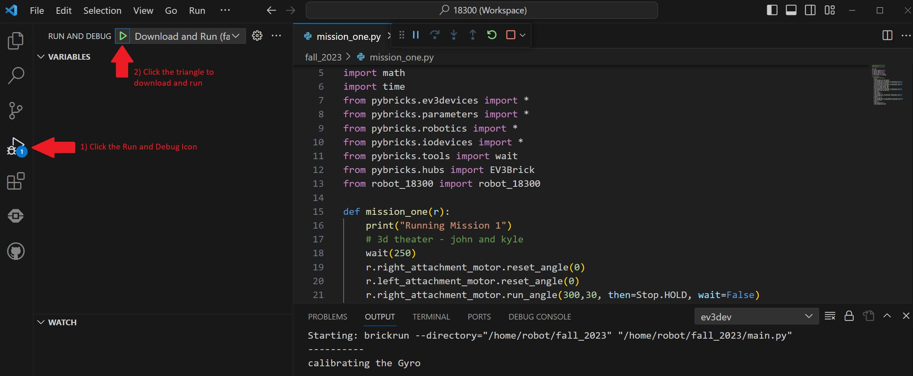
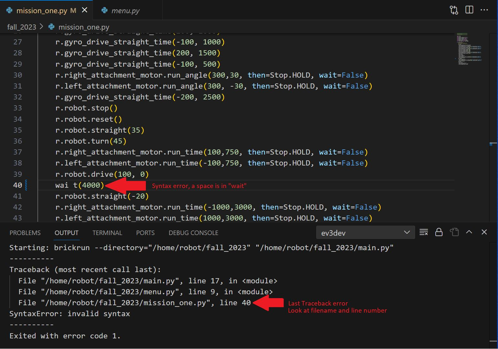

<H2>Robitics Troubleshooting and Debug Tips</H2>

**Why won't VSC connect to the robot?**
* You won't be able to connect to the EV3 if it is currently running a program.  You must stop the program first and then try to connect.

**Why doesn't my code run?**
* There could be a syntax error.  To find syntax errors, it is a good practice to use the "run and debug" operation which can be started in Visual Studio Code by pressing the "F5" key or by using the GUI:
</img>
* The "OUTPUT" window will display errors in your code.  Usually it is a good idea to start at the bottom of the Traceback messages and work backwards.  Here's an example:
</img>
* Remember Python is very picky about indentation.  Code must have the same indentation level, code within a method or while loop must be indented further.

**It takes a long time to connect the USB cable and download code.  How can I speed this up?**
* Wifi USB adapters can eliminate the need to plug a cable onto the EV3 to download code and greatly speed up design iteration.  The CanaKit USB Wifi Adapter works although it is not officially listed.  Not all USB Wifi adapaters will work!  When connected with Wifi and using the "run and debug" mode, you will see print messages in the Visual Studio Code window.  This can be very hepful to get real-time feedback about what the code is doing as the robot is running on the table. [Supported list of USB wifi adapters](https://www.ev3dev.org/docs/networking/)  After plugging the wifi adapter into the EV3 it must be enabled.  Instructions can be found [here](../howto/index.md). This is the CanaKit USB Wifi Adapater which has been seen to work:   
 </img>

**Why did the EV3 stop responding to button pushes?**
* If the EV3 "hangs" and is no longer responsive to the buttons it must be restarted.  This can be done by pressing and holding the center button and the back button at the same time.  If the EV3 frequently hangs, the MicroSD card may need to be re-imaged.  We've seen re-imaging the MicroSD cards solve the hang problem but don't yet understand why.
